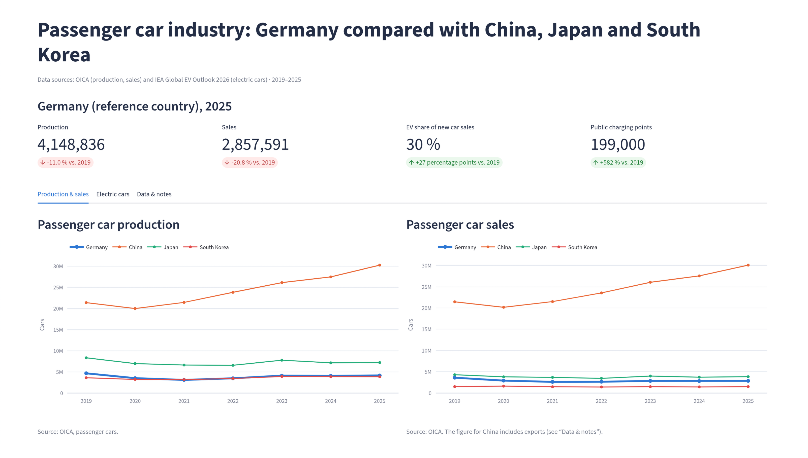
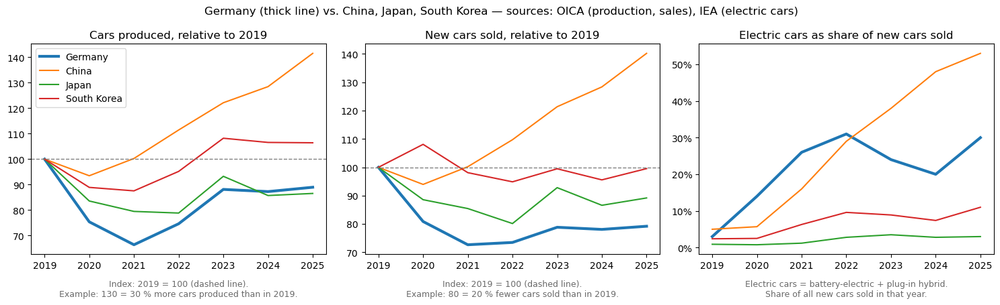
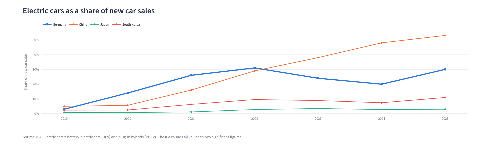
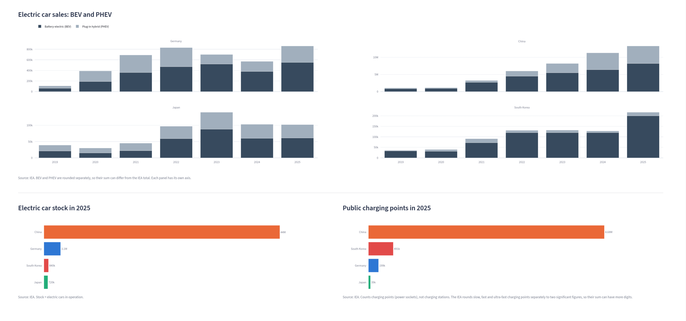
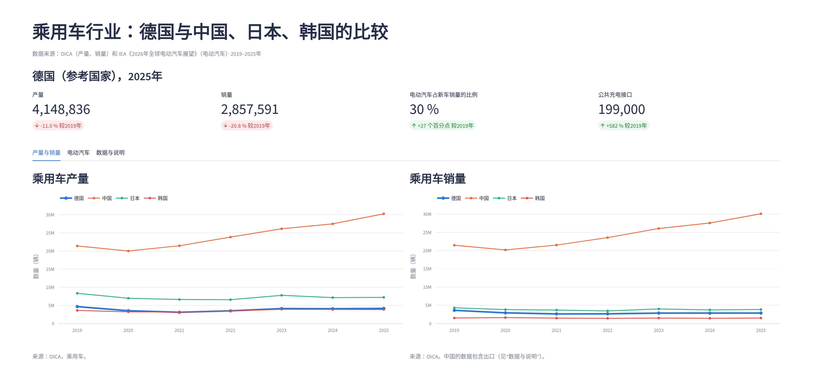

# Passenger Car Industry: Germany vs. China, Japan and South Korea, 2019–2025

How did car production, car sales and the adoption of electric cars develop in Germany compared with China, Japan and South Korea since 2019? This project answers the question with public data from OICA and the IEA. Python loads, cleans and checks the data and exports a small star schema. An interactive dashboard in English, German and Chinese shows the results.

**Live dashboard:** [open the app](https://car-industry-germany-vs-asia-ve5jblutzyvxbprlapnx82.streamlit.app/) · [English](https://car-industry-germany-vs-asia-ve5jblutzyvxbprlapnx82.streamlit.app/?lang=en) · [Deutsch](https://car-industry-germany-vs-asia-ve5jblutzyvxbprlapnx82.streamlit.app/?lang=de) · [中文](https://car-industry-germany-vs-asia-ve5jblutzyvxbprlapnx82.streamlit.app/?lang=zh). The app goes to sleep after a period without visitors; one click on the wake-up button starts it again. Starting takes a short moment: if the page does not load right away, wait a few seconds and reload it.



**Contents:** [Results](#results) · [Charts](#charts) · [Dashboard](#dashboard) · [Data and method](#data-and-method) · [Data quality](#data-quality) · [Limitations](#limitations) · [Power BI](#power-bi) · [How to run](#how-to-run) · [Repository structure](#repository-structure) · [Sources](#sources)

---

## Results

### At a glance

| | Germany | China | Japan | South Korea |
|---|---|---|---|---|
| Car production, 2019 → 2025 | −11.0 % | +41.5 % | −13.5 % | +6.4 % |
| New car sales, 2019 → 2025 | −20.8 % | +40.2 % | −10.8 % | −0.5 % |
| Electric cars as share of new car sales, 2019 → 2025 | 3 % → 30 % | 5 % → 53 % | 0.9 % → 3 % | 2.4 % → 11 % |
| Electric car sales, 2025 | 860,000 | 13,000,000 | 100,000 | 220,000 |
| Electric cars on the road, 2025 | 3,100,000 | 44,000,000 | 720,000 | 840,000 |
| Public charging points, 2025 | 199,000 | 4,680,000 | 39,000 | 491,170 |

Production and sales are OICA figures (passenger cars); electric car figures are IEA figures, rounded by the IEA to two significant figures. "Electric cars" means battery-electric (BEV) and plug-in hybrid (PHEV) cars.

### The report

**Production: China pulled away, Germany and Japan did not recover.** Between 2019 and 2025, Chinese car production grew by 41.5 % (from 21,389,833 to 30,269,903 cars) and South Korean production by 6.4 % (3,612,587 to 3,844,338). Germany built 11.0 % fewer cars in 2025 than in 2019 (4,663,749 to 4,148,836), Japan 13.5 % fewer (8,329,130 to 7,207,025). The pandemic year 2020 hit Germany hardest: production fell by 24.6 %, against 16.4 % in Japan, 11.1 % in South Korea and 6.5 % in China. German production reached its low in 2021, at 66.4 % of the 2019 level. China was back above its 2019 level in 2021 and South Korea in 2023. Germany and Japan have not reached their 2019 level in any year up to 2025.

**Sales: Germany's market shrank the most.** New car sales in China grew by 40.2 % (21,472,091 to 30,103,140), in South Korea they were almost unchanged (−0.5 %, 1,497,035 to 1,490,208), in Japan they fell by 10.8 % (4,301,091 to 3,836,380) and in Germany by 20.8 % (3,607,258 to 2,857,591). Germany is last of the four countries in sales change. Because German sales fell more than German production (−20.8 % against −11.0 %), the ratio of production to sales rose from 1.29 in 2019 to 1.45 in 2025. In 2025 the ratio was 2.58 in South Korea, 1.88 in Japan, 1.45 in Germany and 1.01 in China. The ratio compares production in a country with sales in the same country; the data contain no trade figures, so it is not an export figure. For China it is close to 1.0 in every year (0.99 to 1.01) because the OICA sales figure for China includes exports (see [Data quality](#data-quality)).

**Electric cars: Germany was ahead of China from 2020 to 2022, then China moved ahead.** China's electric car share of new car sales rose in every year, from 5 % in 2019 to 53 % in 2025, and its sales grew from 1,100,000 to 13,000,000 cars. Germany's path was uneven: 3 % in 2019, then 14 % (2020), 26 % (2021) and a peak of 31 % in 2022, when it was still ahead of China (29 %). The share then fell to 24 % in 2023 and 20 % in 2024 before it recovered to 30 % in 2025. In 2023 China moved ahead again (38 % against 24 %) and has stayed ahead since; in 2019 its share (5 %) had also been above Germany's (3 %). In absolute numbers, German electric car sales went from 110,000 in 2019 to 830,000 in 2022, dropped to 570,000 in 2024 and reached 860,000 in 2025, the highest value of the period. Germany ends 2025 second of the four countries by share, well ahead of South Korea (11 %) and Japan (3 %). Japan's share was never above 3.5 % in any of the seven years; its electric car sales were 100,000 in both 2024 and 2025. South Korea's sales rose from 130,000 to 220,000 in 2025.

**The mix of battery-electric and plug-in hybrid cars differs strongly.** In 2025, battery-electric cars made up 92 % of South Korea's electric car sales, 64 % in Germany, 62 % in China and 60 % in Japan. In China the battery-electric share fell from 83 % in 2021 to 57 % in 2024, while plug-in hybrid sales grew from 550,000 to 4,900,000 (shares calculated from the separately rounded IEA values).

**Charging infrastructure: South Korea stands out.** In 2025, China had 44,000,000 electric cars on the road and 4,680,000 public charging points, Germany 3,100,000 and 199,000, South Korea 840,000 and 491,170, and Japan 720,000 and 39,000. Set against each other (calculated: stock ÷ public charging points), this gives 1.7 electric cars per public charging point in South Korea, 9.4 in China, 15.6 in Germany and 18.5 in Japan. This is not a measure of whether charging is sufficient: public points only, home and workplace charging are not counted, and the IEA counts power sockets, not charging stations. Germany's number of public charging points rose by 582 % since 2019 (29,200 to 199,000).

**Where the two sources disagree.** The IEA data allow a cross-check: dividing electric car sales by the electric car share gives the new-car market size the IEA implies. For Germany this lies inside the range allowed by the IEA's rounding in all seven years. It does not for China (2022–2025), Japan (2025) and South Korea (2021, 2024, 2025). For China the reason is documented: the OICA figure is the passenger vehicle sales of the Chinese manufacturers' association CAAM, which include exports (2025: 30.103 million, of which 6.038 million exports). With exports subtracted the OICA figure falls inside the IEA range in 2022, 2024 and 2025, and in 2023 when compared with the passenger car sales of the China Passenger Car Association. For Japan 2025 and South Korea 2021, 2024 and 2025 no published explanation was found. Sources and calculations are in Section 12 of the notebook. For this reason no metric in the project combines OICA volumes with IEA shares, apart from this cross-check.

**Bottom line.** Of the four countries, Germany had the weakest sales development (−20.8 %) and, after Japan, the weakest production development (−11.0 %), while China grew by 41.5 % in production and 40.2 % in sales. In electric cars Germany is second behind China, with a share of 30 % in 2025 and electric car sales of 860,000, the highest of the seven years. Its share, however, fell in 2023 and 2024 while China's kept rising. The project describes these developments; it does not test their causes.

---

## Charts

The notebook (Section 9) and the dashboard show the same development in different forms. The notebook chart indexes production and sales to 2019 = 100 and shows the electric car share:



The dashboard adds the electric car share over time, the split into battery-electric and plug-in hybrid sales, the stock of electric cars and the public charging points:





---

## Dashboard

`dashboard.py` is a [Streamlit](https://streamlit.io) app that reads the exported tables from `data/clean/`.

- **Three languages:** English, German and Chinese, switchable at the top of the sidebar. Direct links: `?lang=en`, `?lang=de` and `?lang=zh` after the app address.
- **Filters:** countries, period (2019–2025) and, for production and sales, absolute values or an index with 2019 = 100.
- **Four key figures** for Germany (reference country): production, sales, electric car share of new car sales and public charging points, each compared with the start of the selected period.
- **Three tabs:** production and sales (including the production-to-sales ratio); electric cars (share, BEV and PHEV sales, stock, charging points); data and notes (key-figure table for 2019 and 2025, filtered data table with CSV download, the OICA/IEA cross-check and notes on sources).
- Every chart has a short caption with its source or definition; all values in the charts come directly from the exported tables.



*The Chinese texts were translated with the help of AI and have not been reviewed by a native speaker. Corrections are welcome as a GitHub issue.*

---

## Data and method

### Data sources

| Source | Content | Used for |
|---|---|---|
| [OICA](https://www.oica.net) production statistics | Passenger car production by country | Production, 2019–2025 (2020 from the 2020 release, all other years from the 2025 release) |
| OICA sales statistics | "Registrations or sales of new vehicles – passenger cars" | Sales, 2019–2025 |
| [IEA Global EV Outlook 2026](https://www.iea.org/reports/global-ev-outlook-2026), data file | Electric car sales (BEV, PHEV), sales share, stock, public charging points | Electric cars, 2019–2025 |

### Pipeline (`autoindustrie_analysis.ipynb`)

| Stage | Sections | What happens |
|---|---|---|
| Setup | 1–2 | Libraries, scope, file paths and one mapping table that links the different country names of OICA and the IEA |
| Load | 3–5 | OICA production, OICA sales and IEA electric car data are read into clean tables |
| Combine and check | 6–7 | One country-year table; completeness, rounding and cross-source checks |
| Analyse | 8–9 | Growth, index, ratios and a country summary; one sanity-check chart |
| Deliver | 10–13 | Star schema, CSV export, limitations, key findings |

The numbers in the text of Sections 7 and 13 of the notebook are generated by the code from the tables, so they always match the data.

### Output tables (`data/clean/`)

| Table | Grain | Content |
|---|---|---|
| `dim_country` | One row per country (4) | Country code, name, region, reference-country flag |
| `dim_year` | One row per year (7) | Year, base-year flag |
| `fact_country_year` | Country × year (28 rows, 19 columns) | Production, sales, production-to-sales ratio, year-on-year changes, indexes (2019 = 100), BEV and PHEV sales, EV sales, EV sales share, EV stock, public charging points, and the OICA/IEA cross-check |
| `country_summary` | One row per country (4) | 2019 vs. 2025 headline metrics: changes, growth rate per year, recovery year, 2025 volumes |

All shares and growth rates are stored as fractions (0.25 = 25 %).

---

## Data quality

Three checks run before any metric is calculated (Section 7 of the notebook):

1. **Completeness:** 28 rows as expected (4 countries × 7 years), no duplicate country-year rows, no missing values.
2. **BEV + PHEV against the IEA total:** the IEA rounds BEV and PHEV separately, so their sum can differ from the IEA total. The largest difference is −6.4 % (South Korea 2022); all 28 country-years are consistent within the IEA's rounding.
3. **OICA sales against the IEA-implied market:** the IEA rounds all values to two significant figures, so the implied market (EV sales ÷ EV share) lies within a rounding band. OICA sales are inside the band for Germany in all seven years. They are outside it for China 2022–2025, Japan 2025 and South Korea 2021, 2024 and 2025 (see [Results](#results)).

---

## Limitations

- **Short time window:** seven annual values per country, 2019–2025. The project compares developments and does not test causes. 2026 is not included.
- **Definitions differ between the sources:** OICA does not say which countries report registrations and which report sales, and does not define "passenger cars". IEA "cars" are passenger light-duty vehicles including SUVs and light trucks.
- **OICA and IEA do not always match** (see above). OICA's sales figure for China includes exports.
- **IEA rounding:** all IEA values have at most two significant figures. Public charging points are sums of three rounded categories (slow, fast, ultra-fast) and show more digits; some categories have no value in some years.
- **Not covered:** prices, individual manufacturers, imports and exports, policy measures.

The full list with all sources and calculations is in Section 12 of the notebook.

---

## Power BI

The four tables in `data/clean/` are prepared as a star schema for Power BI. **A Power BI report has not been built or tested for this project;** the interactive analysis is the Streamlit dashboard. Anyone who wants to use Power BI can load the tables directly:

1. In Power BI Desktop: *Get data → Text/CSV* and load the four files from `data/clean/`.
2. Create the relationships: `fact_country_year[country_code]` → `dim_country[country_code]` (many-to-one), `fact_country_year[year]` → `dim_year[year]` (many-to-one), `country_summary[country_code]` → `dim_country[country_code]` (one-to-one).
3. Format shares and growth rates as percentages (they are stored as fractions).

---

## How to run

The cleaned tables are included, so the dashboard runs without the notebook.

```bash
# dashboard
pip install -r requirements.txt
streamlit run dashboard.py
```

Start Streamlit from the project folder, so that the light theme in `.streamlit/config.toml` is loaded. The dashboard can be deployed from this repository on Streamlit Community Cloud with `dashboard.py` as the main file.

To rebuild the tables, run the notebook from the project folder (the folder that contains `data/`):

```bash
pip install pandas numpy matplotlib openpyxl jupyter
jupyter lab autoindustrie_analysis.ipynb
```

The notebook was executed with pandas 3.0.2, numpy 2.4.4, matplotlib 3.10.9 and openpyxl 3.1.5. Raw files stay untouched in `data/`; cleaned tables are written to `data/clean/`.

---

## Repository structure

```
.
├── autoindustrie_analysis.ipynb    # cleaning, checks, metrics, export
├── dashboard.py                    # Streamlit dashboard (EN / DE / ZH)
├── requirements.txt                # dashboard dependencies
├── .streamlit/config.toml          # dashboard theme
├── images/                         # screenshots used in this README
└── data/
    ├── prod-passenger-cars-2025.xlsx   # OICA production, 2019 and 2021–2025
    ├── Passenger-Cars-2020.xlsx        # OICA production, 2019 and 2020
    ├── sales-cars-2025.xlsx            # OICA sales, 2019–2025
    ├── EV data by country 2026.xlsx    # IEA Global EV Outlook 2026 data
    └── clean/                          # exported tables (star schema)
        ├── dim_country.csv
        ├── dim_year.csv
        ├── fact_country_year.csv
        └── country_summary.csv
```

The raw files are the original downloads from OICA and the IEA; the terms of use of the providers apply.

---

## Sources

- OICA: [oica.net](https://www.oica.net), production and sales statistics (passenger cars).
- IEA: [Global EV Outlook 2026](https://www.iea.org/reports/global-ev-outlook-2026) and the accompanying data file.
- China, OICA vs. IEA: [Gasgoo, China's 2025 auto market](https://autonews.gasgoo.com/articles/news/chinas-2025-auto-market-hits-new-highs-in-both-annual-sales-output-2011438280283627520). More sources for China, Japan and South Korea are linked in Section 12 of the notebook.
